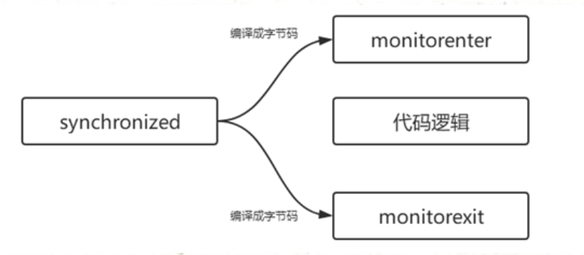
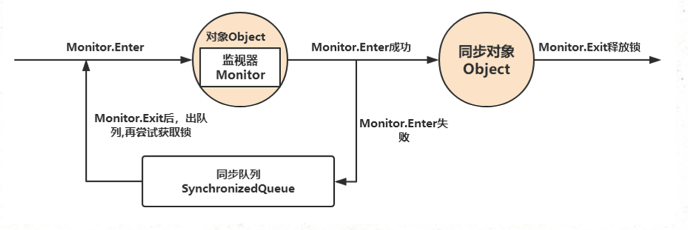

[TOC]

锁的种类

> 锁并不是只能属于一个分类，比如一个锁可以同时是悲观锁、可重入锁、公平锁、可中断锁等待
>
> 

- 排他锁(X锁)
  - 又称为写锁，独占锁。如果事务T对数据A加上排他锁以后，则其他事务不能再对A加任何类型的锁，获取排他锁的事务既能读取数据，又能修改数据。
  
- 共享锁(S锁)
  - 共享锁用于不更改或不更新数据的操作(只读操作)，如果事务T对数据A加上共享锁以后，则其他事务只能对A再加共享锁，不能加排他锁。获取共享锁的事务只能读取数据，不能修改数据。
  
- 悲观锁

  - 锁的一种宏观分类方式是悲观锁和乐观锁。悲观锁和乐观锁并不是特指某个锁(Java中没有哪个Lock实现类就叫PessimisticLock或OptimisticLock),而是在并发情况下的两种不同策略。
  - 悲观锁(Pessimistic Lock),就是很悲观,每次别人拿数据的时候都认为别人会修改。所以每次在拿数据的时候都会上锁。这样别人想拿数据就别挡住，直到悲观锁被释放。

- 乐观锁

  - 乐观锁(Optimistic Lock)，就是很乐观，每次去拿数据的时候都认为别人不会修改。所以不会上锁。但是如果想要更新数据，则会在更新前检查在读取至更新这段时间别人有没有修改过这个数据。如果修改过，则重新读取，再次尝试更新，循环上述步骤直至成功(当然也允许更新失败的线程放弃操作)

  - 悲观锁阻塞事务，乐观锁回滚重试，它们各有优缺点。像乐观锁适合用于写比较少的情况下，即冲突真的很少发生的时候，这样可以省去锁的开销，加大了系统的整个吞吐量。但如果经常发生冲突，上层应用不断的进行重试，这样反倒是降低了性能，所以这种情况下用悲观锁比较合适。

- 自旋锁

- 偏向锁
  - 

    


多线程编程中，有可能会出现多个线程同时访问同一个共享、可变资源的情况，这个资源我们称之为临界资源:这种资源可能是:对象、变量、文件等。由于线程的执行过程是不可控的，所以需要同步机制来协同对对象可变状态的访问。所有的并发模式在解决线程安全问题时，采用的方案都是序列化访问临界资源。即在同一时刻，只能有一个线程访问临界资源，也称作同步互斥访问。

> 共享:资源可以由多个线程同时访问
>
> 可变:资源可以在其声明周期内被修改


Java中，提供了两种方式来实现同步互斥访问:synchronized和Lock

同步器的本质就是加锁

加锁目的:序列化访问临界资源，即同一时刻只能有一个线程访问临界资源(同步互斥访问)

需要注意的是:当多个线程执行一个方法时，该方法内部的局部变量并不是临界资源，因为这些局部变量是在每个线程的私有栈中，因此不具有共享性，不会导致线程安全问题。


## synchronized

synchronized内置锁是一种对象锁(锁的是对象而非引用)，作用粒度是对象，可以用来实现对临界资源的同步互斥访问，是可重入的。

加锁的方式:

> 1. 同步实例方法，锁是当前实例对象
> 2. 同步类方法，锁是当前类对象
> 3. 同步代码块，锁是括号里面的对象


synchronized原理

​	synchronized是基于JVM内置锁实现，通过内部对象Monitor(监视器锁)实现，基于进入与退出Monitor对象实现方法与代码块同步，监视器锁的实现依赖底层操作系统的Mutex lock(互斥锁)实现，它是一个重量级锁 性能较低。当然，JVM内置锁在1.5之后版本做了重大的优化，如锁粗化(Lock Coarsening)、锁消除(Lock Elimination)、轻量级锁(Lightweight Locking)、偏向锁(Biased Locking)、适应性自旋转(Adaptive Spinning)等技术来减少锁操作的开销，内置锁的并发性能已经基本与Lock持平。

synchronized关键字被编译成字节码后会被翻译成`monitorenter`和`monitorexit`两条指令分别在同步代码块逻辑代码的起始位置与结束位置。




每个同步对象都有一个自己的Monitor(监视器锁),加锁过程如下图



synchronized关键字

synchronized关键字可以实现一个简单的策略来防止线程干扰和内存一致性错误，如果一个对象对多个线程是可见的，那么对该对象的所有读或者写都将通过同步的方式来进行，具体表现如下:

- synchronized关键字提供了一种锁的机制，能够确保共享变量的互斥访问，从而防止数据不一致的问题出现
- synchronized关键包括monitor enter和monitor exit两个JVM指令，它能够保证在任何时候任何线程执行到monitor enter成功之前都必须从主内存中获取数据，而不是从缓存中，在monitor exit运行成功之后，共享变量被更新后的值必须刷入主内存
- synchronized的指令严格遵循java happens-before规则，一个monitor exit指令之前必须要有一个monitor enter

Monitorenter: 

每个对象都与一个monitor相关联，一个monitor的lock的锁只能被一个线程在同一时间访问，在一个线程尝试获得与对象关联monitor的所有权时会发生如下的几件事情。

- 如果monitor的计数器为0，则意味着该monitor的lock还没有被获得，某个线程获得之后将立即对该计数器加一，从此该线程就是这个monitor的所有者了。
- 如果一个已经拥有该monitor所有权的线程充重入，则会导致monitor计数器再次增加。
- 如果monitor已经被其他线程所拥有，则其他线程尝试获取该monitor的所有权时，会被陷入阻塞状态直到monitor计数器变为0，才能再次尝试获取对monitor的所有权。


Monitorexit

释放对monitor的所有权，想要释放对某个对象关联的monitor的所有权的前提是，你已经获得了所有权。释放monitor所有权的过程比较简单，就是将monitor的计数器减一，如果计数器的结果为0，那就意味着该线程不再拥有对该monitor的所有权，通俗地讲就是解锁。与此同时被该monitor block的线程将再次尝试获得对该monitor的所有权。


使用synchronized需要注意的问题

1. monitor关联的对象不能为空，否则无法获取monitor

2. synchronized作用域太大，由于synchronized关键字存在排他性，也就是说所有的线程必须串行地经过synchronized保护的共享区域，如果synchronized作用域越大，则代表着其效率越低，甚至还会丧失并发优势，synchronized关键字应该尽可能地只用于共享资源(数据)的读写作用域。

3. 不同的monitor企图锁相同的方法,例如下面代码构造了5个线程，同时也构造了5个Runnable实例，Runnable作为线程逻辑执行单元传递给Thread，但是synchronized根本互斥不了与之对应的作用域，线程之间进行monitor lock的争抢只能发生在与monitor关联的同一个引用上，上面的代码每一个线程争抢的monitor关联引用都是彼此独立的，因此不可能起到互斥的作用。

   ```java
   public static class Task implements Runnable {
     
       private final Object MUTEX = new Object();
       
       @Override
       public void run() {
         //..
         synchronized(MUTEX) {
           //...
         }
       }
     
     
       public static void main(String[] args) {
         for (int i = 0; i < 5; i++) {
           new Thread(Task::new).start();
         }
       }
   }
   ```

4. 多个锁的交叉导致死锁，多个锁的交叉很容易引起线程出现死锁的情况，程序本身没有任何错误输出，但就是不工作，例如下面例子

   ```java
   private final Object MUTEX_READ = new Object();
   private final Object MUTEX_WRITE = new Object();
   
   public void read() {
       synchronized(MUTEX_READ) {
           synchronized(MUTEX_WRITE) {
             //
           }
       }
   }
   
   public void write() {
       synchronized(MUTEX_WRITE) {
           synchronized(MUTEX_READ) {
              //...
           }
       }
   }
   ```


程序死锁的可能原因:

1. 交叉锁可导致程序出现死锁

   ​        线程A持有R1的锁等待获取R2的锁，线程B持有R2的锁等待获取R1的锁，这种情况最容易发生程序死锁的问题。

2. 内存不足

   ​        当并发请求系统可用内存时，如果此时系统内存不足，则可能出现死锁的情况。举个例子，两个线程T1和T2，执行某个任务，其中T1已经获取了10MB内存，T2获取了20MB内存，如果每个线程的执行单元都需要30MB的内存，但是剩余可用的内存刚好为20MB，那么两个线程尔有可能都在等待彼此能够释放内存资源。

3. 一问一答式的数据交换

   ​		服务器开启某个端口，等待客户端访问，客户端发送请求立即等待接收，但是由于某种原因服务器错过了客户端的请求，仍然在等待一问一答式的数据交换，此时服务器和客户端都在等待着双方发送数据。

4. 数据库锁

   ​        无论是数据库表级别的锁，还是行级别的锁，比如某个线程执行for update语句退出了事务，其他线程访问该数据库时都将陷入死锁。

5. 文件锁

   ​        同理，某线程获得了文件锁意外退出，其他读取该文件的线程也将会进入死锁知道系统释放文件句柄资源。

6. 死循环引起的死锁

   ​		程序由于代码原因或者对某些一样处理的不得当，进入了死循环，虽然查看线程堆栈信息不会发现任何死锁的迹象，但是程序不工作，CPU利用率又居高不下，这种死锁一般称为系统假死，是一种最为致命也是最难排查的死锁现象，由于重现困难，进程对系统资源的使用量又达到了极限，想要做出dump有时候也是很困难的。


synchroized关键字的缺陷

synchronized关键字提供了一种排他式的数据同步机制，某个线程在获取monitory lock的时候可能会被阻塞，而这种阻塞有两个很明显的缺陷:

- 无法控制阻塞的时长(比如想设置最多1分钟获得执行权，否则放弃，但是很显然synchronized做不到)
- 阻塞不可被中断


