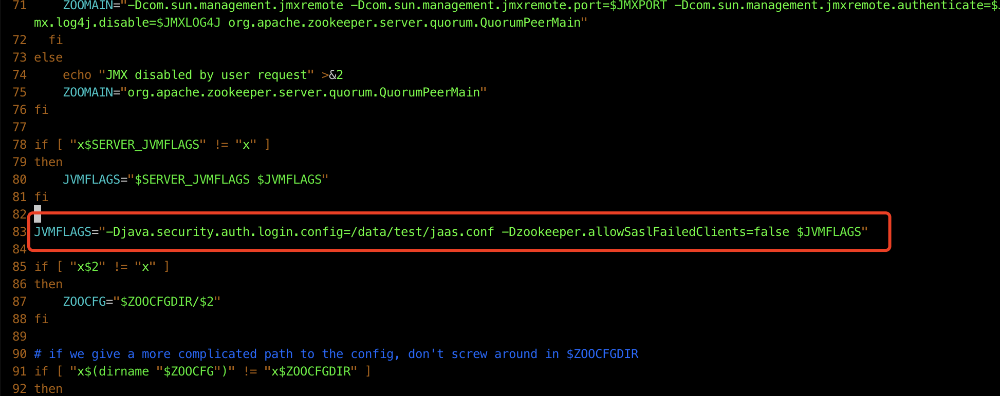
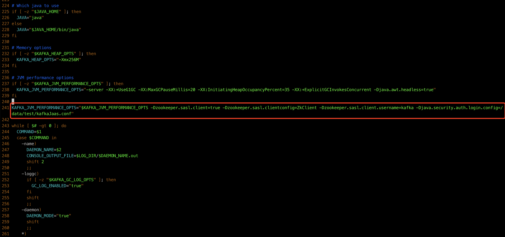
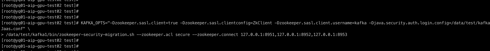

[TOC]

# Kafka配置zookeeper认证


## 一、Zookeeper配置


#### 1.开启zookeeper认证功能

> bin/zoo.cfg

```cfg
authProvider.1=org.apache.zookeeper.server.auth.SASLAuthenticationProvider
requireClientAuthScheme=sasl
jaasLoginRenew=3600000
```


#### 2.创建jaas.conf文件，配置认证的用户名密码

> 例: /data/test/jaas.conf

```conf
Server {
  org.apache.zookeeper.server.auth.DigestLoginModule required
  user_admin="password"
  user_kafka="password";
};
```


#### 3.更新zookeeper的JVMFLAG

-Djava.security.auth.login.config 是刚刚创建的jaas.conf文件地址

> bin/zkServer.sh

```
JVMFLAGS="-Djava.security.auth.login.config=/data/test/jaas.conf -Dzookeeper.allowSaslFailedClients=false $JVMFLAGS"
```





#### 4.重启zookeeper

```shell
bin/zkServer.sh restart
```


## 二、Kafka配置

#### 1.创建kafkaJaas.conf文件，里面配置了zk的用户名密码

> 例: /data/test/kafkaJaas.conf

```conf
ZkClient {
  org.apache.zookeeper.server.auth.DigestLoginModule required
  username="kafka"
  password="password";
};
```


#### 2.更新kafka的jvm options

-Djava.security.auth.login.config为刚刚创建的kafkaJass.conf文件地址

> bin/kafka-run-class.sh

```
KAFKA_JVM_PERFORMANCE_OPTS="$KAFKA_JVM_PERFORMANCE_OPTS -Dzookeeper.sasl.client=true -Dzookeeper.sasl.clientconfig=ZkClient -Dzookeeper.sasl.client.username=kafka -Djava.security.auth.login.config=/data/test/kafkaJaas.conf"
```




#### 3.配置kafka使用zookeeper的ACL 

> config/server.properties

```properties
zookeeper.set.acl=true
```


#### 4.执行ACL迁移

-Djava.security.auth.login.config 为刚刚新增的kafkaJaas.conf文件地址

/data/test/kafka1/bin/zookeeper-security-migration.sh  kafka安装目录下的可执行文件

--zookeeper.connect 是zookeeper的地址

```shell
KAFKA_OPTS="-Dzookeeper.sasl.client=true -Dzookeeper.sasl.clientconfig=ZkClient -Dzookeeper.sasl.client.username=kafka -Djava.security.auth.login.config=/data/test/kafkaJaas.conf" /data/test/kafka1/bin/zookeeper-security-migration.sh --zookeeper.acl secure --zookeeper.connect 127.0.0.1:8951,127.0.0.1:8952,127.0.0.1:8953
```



#### 5.重启kafka

```shell
bin/kafka-server-stop.sh
bin/kafka-server-start.sh -daemon config/server.properties
```


#### 6.验证zk的acl

例:

```zk
getAcl /brokers
```

