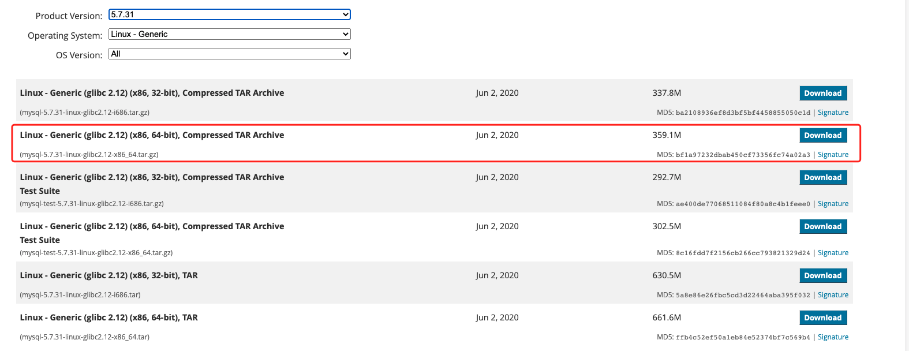
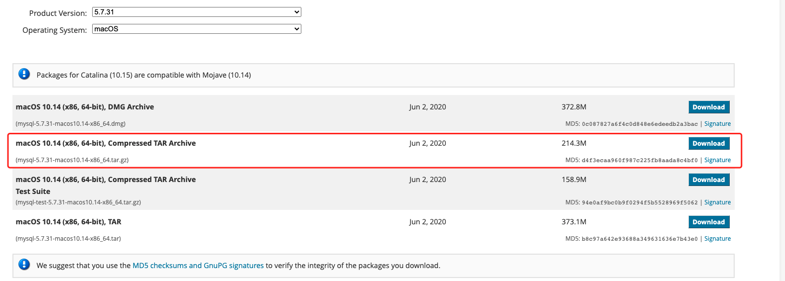

[TOC]


# MySQL安装文档


## 一、Installing MySQL on Unix/Linux Using Generic Binaries


###  1.下载MySQL

```http
https://downloads.mysql.com/archives/community/
```

根据不同的系统版本下载不同版本的mysql

例如: 下载linux版本的二进制安装包




例如:下载mac版本的二进制安装包



### 2.安装mysql

#### 2.1安装mysql依赖

如果没有libaio则mysql初始化和启动就会报错 (mac系统可以省略这一步)

```shell
yum install libaio
```


#### 2.2 解压安装mysql

一定要设置basedir为下载解压后的mysql目录 (下面是以centos系统为例，mac系统可以相应简化)

```bash
tar -xvf mysql-5.7.32-el7-x86_64.tar.gz
cd mysql-5.7.32-el7-x86_64
groupadd mysql
useradd -r -g mysql -s /bin/false mysql
mkdir data etc tmp
touch etc/my.cnf mysqld_err.log
chown -R mysql:mysql /data/mysql-5.7.32-el7-x86_64
chmod 755 -R /data/mysql-5.7.32-el7-x86_64
bin/mysqld --initialize --basedir=/data/mysql-5.7.32-el7-x86_64 --datadir=/data/mysql-5.7.32-el7-x86_64/data --user=mysql
```


### 3.修改配置文件

```conf
[client]
port=8906
default-character-set=utf8mb4
socket=/data/mysql-5.7.32-el7-x86_64/tmp/mysql.sock

[mysqld]
user=mysql
port=8906

slow_query_log=1
long-query-time=1

log_timestamps=SYSTEM

max_connections=5000

character-set-server=utf8mb4

basedir=/data/mysql-5.7.32-el7-x86_64
tmpdir=/data/mysql-5.7.32-el7-x86_64/tmp
datadir=/data/mysql-5.7.32-el7-x86_64/data
socket=/data/mysql-5.7.32-el7-x86_64/tmp/mysql.sock
log-error=/data/mysql-5.7.32-el7-x86_64/mysqld_err.log
pid-file=/data/mysql-5.7.32-el7-x86_64/mysqld.pid
```


### 4.配置环境

centos系统可以配置到`~/.bashrc`中。mac系统如果用的是zsh可以配置到`~/.zprofile`中

```shll
export MYSQL_HOME=/data/mysql-5.7.32-el7-x86_64
export PATH=$MYSQL_HOME/bin:$PATH
```


因为mysql配置文件加载顺序的原因， ~/.my.cnf优先级最高

```shell
ln -s /data/mysql-5.7.32-el7-x86_64/etc/my.cnf ~/.my.cnf
```


### 5.启动MySQL

启动mysqld

```shell
mysqld_safe --defaults-file=~/.my.cnf&
```


修改mysql密码

```sql
mysql -uroot -p
mysql> set password=password('luo.123');
mysql> flush privileges;
```


配置本机免密登录

```shell
mysql_config_editor set -h 127.0.0.1 -P 8906 -u root -p
```


